# Privatekonomi - Screenshot Documentation

Detta dokument innehåller screenshots av alla huvudfunktioner i Privatekonomi-applikationen. Dokumentationen uppdateras löpande när gränssnittet förändras.

**Senast uppdaterad:** 2025-10-24

---

## 📋 Innehållsförteckning

1. [Dashboard](#dashboard)
2. [Transaktioner](#transaktioner)
3. [Budget](#budget)
4. [Lån & Krediter](#lån--krediter)
5. [Löneutveckling](#löneutveckling)
6. [Sparmål](#sparmål)
7. [Investeringar](#investeringar)
8. [Kategorier](#kategorier)
9. [Import](#import)
10. [Balansräkning](#balansräkning)
11. [Nettoförmögenhetskurva](#nettoförmögenhetskurva)
12. [Skattedeklaration](#skattedeklaration)
13. [Riktlinjer för uppdatering](#riktlinjer-för-uppdatering)

---

## Dashboard

Dashboard ger en översikt över din ekonomi med inkomster, utgifter, kassaflöde och visualiseringar.

### Ljust läge
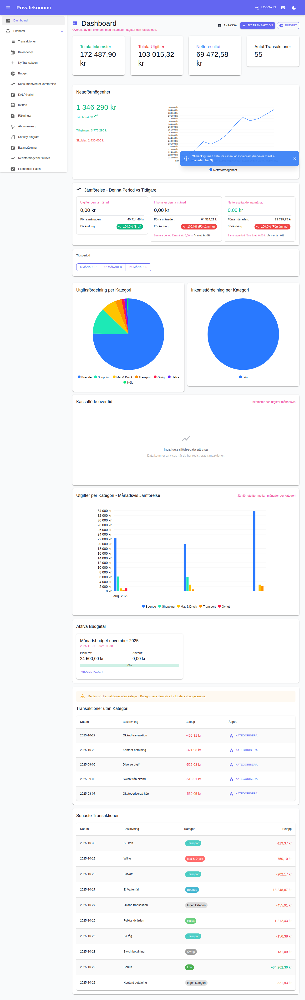

**Funktioner som visas:**
- 💰 Totala inkomster, utgifter och nettoresultat
- 📊 Cirkeldiagram för utgifts- och inkomstfördelning per kategori
- 📈 Linjediagram för kassaflöde över tid
- 📊 Stapeldiagram för utgifter per kategori månadsvis
- 📋 Aktiva budgetar med progress bar
- ⚠️ Transaktioner utan kategori
- 📝 Senaste transaktioner

### Mörkt läge


**Funktioner i mörkt läge:**
- Samma funktioner som ljust läge med anpassad färgpalett
- Högre kontrast för bättre läsbarhet i mörka miljöer
- WCAG 2.1 Nivå AA compliance

---

## Transaktioner

Hantera alla dina transaktioner med sökning, filtrering och export.

### Transaktionslista
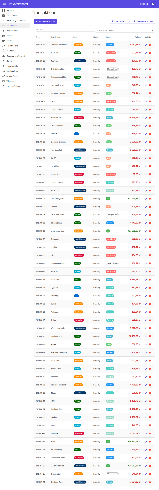

**Funktioner som visas:**
- 📝 Ny Transaktion - knapp för att lägga till transaktion
- 📥 Exportera CSV - exportera transaktioner till CSV-format
- 📥 Exportera JSON - exportera transaktioner till JSON-format
- 🔍 Sökfunktion för att filtrera transaktioner
- 🏠 Filtrera efter hushåll
- 📋 Transaktionstabell med kolumner:
  - Datum
  - Beskrivning
  - Bank (färgkodade chips)
  - Hushåll
  - Kategori (färgkodade chips)
  - Belopp (grönt för inkomster, rött för utgifter)
  - Åtgärder (redigera och ta bort)

**Viktiga funktioner:**
- **Split-kategorisering**: Möjlighet att dela upp transaktioner i flera kategorier
- **Automatisk kategorisering**: Regelbaserad kategorisering med 44+ förkonfigurerade regler
- **Okategoriserad markering**: Tydlig indikation på transaktioner utan kategori
- **Multi-kategori visning**: Flera kategori-chips för delade transaktioner

---

## Budget

Skapa och följ upp budgetar med visualisering av planerat vs faktiskt utfall.

### Budgetöversikt
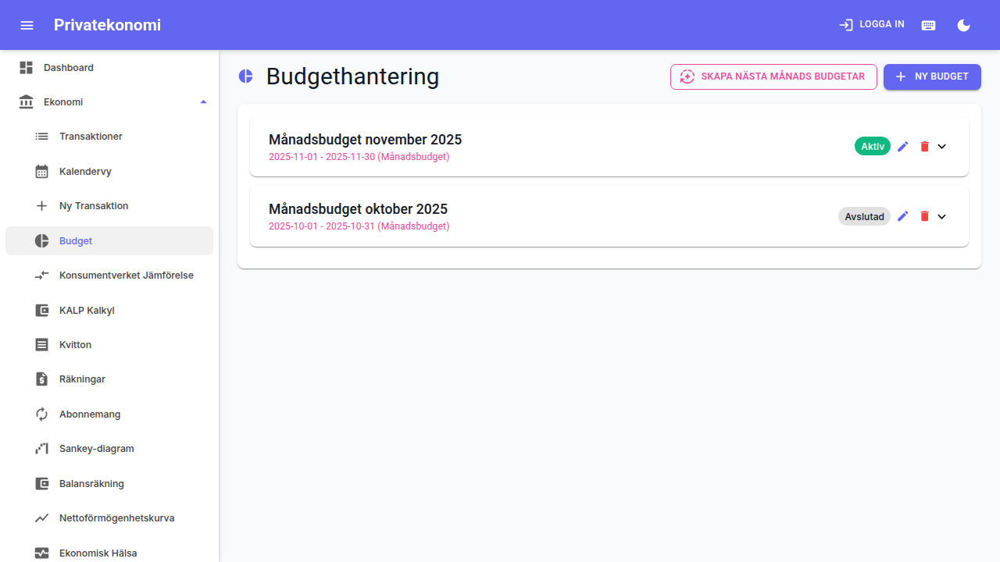

**Funktioner som visas:**
- 📅 Skapa Nästa Månads Budgetar - automatisk kopiering av budgetar
- ➕ Ny Budget - skapa anpassad budget
- 📊 Budget-kort med:
  - Budgetnamn och period
  - Status (Aktiv/Avslutad)
  - Planerat belopp
  - Använt belopp
  - Progress bar med procent
  - Åtgärder (redigera, ta bort, visa detaljer)

**Budgettyper:**
- Månadsbudget
- Årsbudget
- Anpassad period

---

## Lån & Krediter

Hantera och följ upp alla lån och krediter med amorteringsplan.

### Lånöversikt
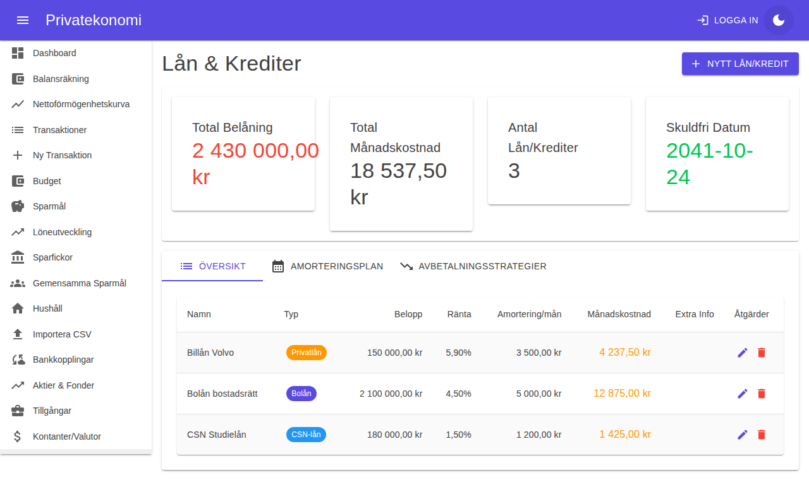

**Funktioner som visas:**
- 💳 Sammanfattning:
  - Total Belåning (röd text)
  - Total Månadskostnad
  - Antal Lån/Krediter
  - Skuldfri Datum (grön text)
- 📊 Flikar:
  - **Översikt** - lista över alla lån
  - **Amorteringsplan** - detaljerad amorteringsplan
  - **Avbetalningsstrategier** - optimering av avbetalning
- 📋 Låntabell med:
  - Namn
  - Typ (Bolån, Privatlån, CSN-lån)
  - Belopp
  - Ränta
  - Amortering/månad
  - Månadskostnad
  - Extra info (t.ex. bindningstid)
  - Åtgärder

**Låntyper som stöds:**
- 🏠 Bolån
- 🚗 Privatlån (billån, etc.)
- 🎓 CSN-lån
- 💳 Kreditkort
- 📝 Anpassade lån

---

## Löneutveckling

Spåra och följa din löneutveckling över tid.

### Lönehistorik
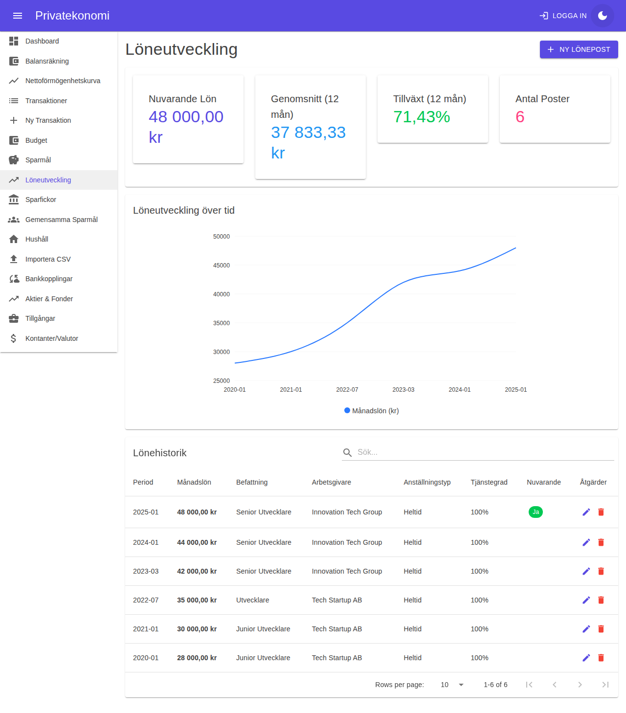

**Funktioner som visas:**
- 💼 Sammanfattning:
  - Nuvarande Lön
  - Genomsnitt (12 månader)
  - Tillväxt (12 månader) i procent
  - Antal Poster
- 📈 Interaktiv graf:
  - Visualisering av löneutveckling över tid
  - Spåra hela karriären (50+ år support)
- 📋 Lönehistorik-tabell:
  - Period
  - Månadslön
  - Befattning
  - Arbetsgivare
  - Anställningstyp
  - Tjänstegrad (%)
  - Nuvarande (markerad)
  - Åtgärder
- 🔍 Sökfunktion i historiken

**Användningsområden:**
- Dokumentera jobbbyten
- Spåra löneförhöjningar
- Beräkna genomsnittslön
- Analysera lönetillväxt

---

## Sparmål

Hantera personliga sparmål med prioritering och progress tracking.

### Sparmålsöversikt
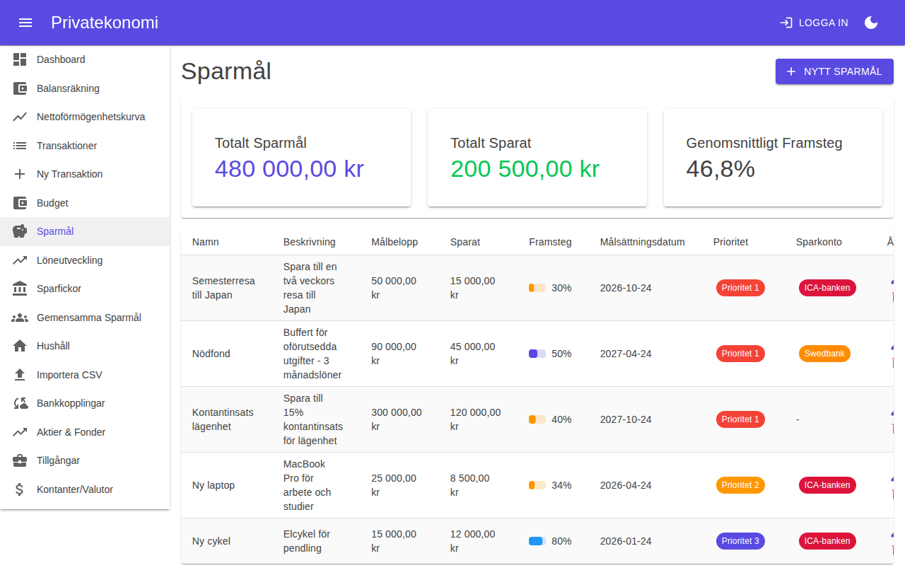

**Funktioner som visas:**
- 💰 Översikt:
  - Totalt Sparmål (summa av alla mål)
  - Totalt Sparat (nuvarande sparande)
  - Genomsnittligt Framsteg i procent
- 📊 Sparmålstabell med kolumner:
  - Namn
  - Beskrivning
  - Målbelopp
  - Sparat
  - Framsteg (progress bar + procent)
  - Målsättningsdatum
  - Prioritet (1, 2, 3 med färgkodning)
  - Sparkonto (bank)
  - Åtgärder (redigera och ta bort)

**Exempel på sparmål:**
- Semesterresa till Japan (50 000 kr)
- Nödfond (90 000 kr)
- Kontantinsats lägenhet (300 000 kr)
- Ny laptop (25 000 kr)
- Ny cykel (15 000 kr)

**Viktiga funktioner:**
- **Prioritering**: Sätt prioritet 1-3 för att fokusera på viktigaste målen
- **Progress tracking**: Visuell progress bar visar framsteg
- **Bankkoppling**: Koppla sparmål till specifikt sparkonto
- **Målsättningsdatum**: Sätt deadline för att nå målet

---

## Investeringar

Hantera aktier, fonder och certifikat med automatisk kursuppdatering.

### Investeringsöversikt
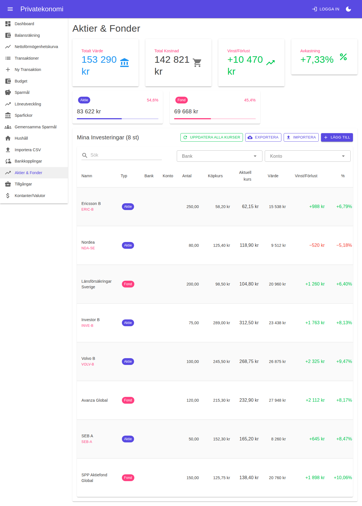

**Funktioner som visas:**
- 💰 Sammanfattning:
  - Totalt Värde (aktuellt marknadsvärde)
  - Total Kostnad (inköpspris)
  - Vinst/Förlust i kronor
  - Avkastning i procent
- 📊 Fördelning:
  - Aktier vs Fonder (progress bar visar procentuell fördelning)
- 🔄 Åtgärder:
  - **Uppdatera alla kurser** - Hämta senaste kurser från Yahoo Finance
  - **Exportera** - Exportera till CSV
  - **Importera** - Importera från Avanza
  - **Lägg till** - Lägg till ny investering manuellt
- 📋 Investeringstabell:
  - Namn & Ticker
  - Typ (Aktie/Fond med färgkodade chips)
  - Bank
  - Konto
  - Antal
  - Köpkurs
  - Aktuell kurs (uppdateras automatiskt)
  - Värde (antal × aktuell kurs)
  - Vinst/Förlust (grönt för vinst, rött för förlust)
  - Procent
  - Åtgärder (uppdatera kurs, redigera, sälja, ta bort)
- 🔍 Filtrering:
  - Sök efter investeringar
  - Filtrera efter Bank
  - Filtrera efter Konto
- 📊 Sortering: Klicka på kolumnrubriker för att sortera

**Exempel på investeringar:**
- Aktier: Ericsson B, Nordea, Investor B, Volvo B, SEB A
- Fonder: Länsförsäkringar Sverige, Avanza Global, SPP Aktiefond Global

**Viktiga funktioner:**
- **Yahoo Finance integration**: Automatisk kursuppdatering via API
- **Avanza import**: Importera investeringar från Avanza Bank
- **Färgkodning**: Grön för vinst, röd för förlust
- **Realtidsvärdering**: Se aktuellt värde baserat på senaste kursen

---

## Kategorier

Hantera och organisera utgifts- och inkomstkategorier.

### Kategoriöversikt
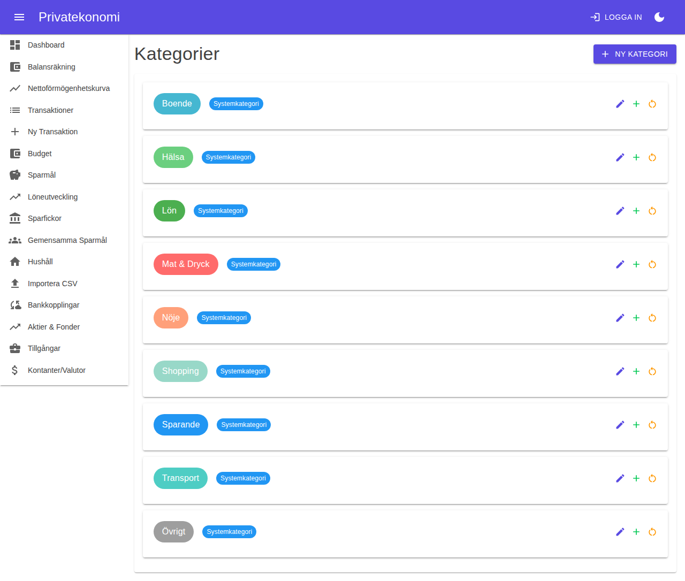

**Funktioner som visas:**
- ➕ Ny Kategori - Skapa anpassad kategori
- 📋 Kategorilistor med färgkodade chips:
  - Boende (blå)
  - Hälsa (grön)
  - Lön (lila)
  - Mat & Dryck (orange)
  - Nöje (rosa)
  - Shopping (turkos)
  - Sparande (gul)
  - Transport (cyan)
  - Övrigt (grå)
- 🏷️ Systemkategori-märkning för förkonfigurerade kategorier
- 🔧 Åtgärder för varje kategori:
  - Redigera kategori
  - Lägg till underkategori
  - Återställ till standard

**Kategorityper:**
- **Systemkategorier**: Förkonfigurerade kategorier som kan återställas
- **Anpassade kategorier**: Användarskapade kategorier
- **Underkategorier**: Hierarkisk struktur för bättre organisering

**Viktiga funktioner:**
- **Färgkodning**: Varje kategori har en unik färg för enkel identifiering
- **Hierarkisk struktur**: Möjlighet att skapa underkategorier
- **Återställning**: Systemkategorier kan återställas till standardinställningar
- **Automatisk kategorisering**: 44+ förkonfigurerade regler för automatisk kategorisering
- **Regeltyper**: Innehåller, exakt matchning, börjar med, slutar med, regex

---

## Import

Importera transaktioner från banker.

### Importgränssnitt
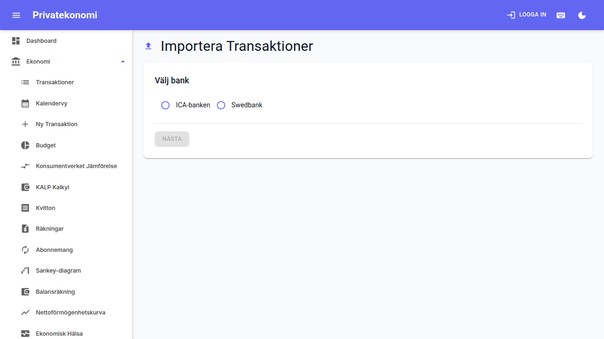

**Funktioner som visas:**
- 🏦 Bankval:
  - ICA-banken
  - Swedbank
  - Radio buttons för att välja bank
- ➡️ Nästa-knapp (aktiveras när bank är vald)

**Import-process:**
1. **Välj bank** - Välj från vilken bank du vill importera
2. **Välj fil** - Ladda upp CSV-fil från banken
3. **Förhandsvisning** - Se transaktioner innan import
4. **Mappning** - Mappa kolumner om nödvändigt
5. **Importera** - Dubblettdetektion och import
6. **Sammanfattning** - Översikt av importerade transaktioner

**Bankformat som stöds:**
- **ICA-banken**: CSV-format med specifik kolumnstruktur
- **Swedbank**: CSV-format med specifik kolumnstruktur  
- **Avanza**: Separata funktioner för investeringar

**Viktiga funktioner:**
- **Automatisk dubblettdetektion**: Undviker duplicerade transaktioner
- **Förhandsvisning**: Se transaktioner innan de importeras
- **Kolumnmappning**: Automatisk eller manuell mappning av kolumner
- **Felhantering**: Tydliga felmeddelanden vid problem
- **Bulkimport**: Importera många transaktioner samtidigt

---

## Skattedeklaration

_Screenshots kommer att läggas till när sidan är tillgänglig_

Sverige-specifika skattefunktioner.

**Planerade funktioner att dokumentera:**
- ROT/RUT-avdrag
- K4 Kapitalvinster
- ISK/KF schablonbeskattning
- SIE-export för bokföring
- Reseavdrag

---

## Balansräkning

Översikt över din ekonomiska situation med tillgångar, skulder och nettoförmögenhet.

### Balansräkningsöversikt
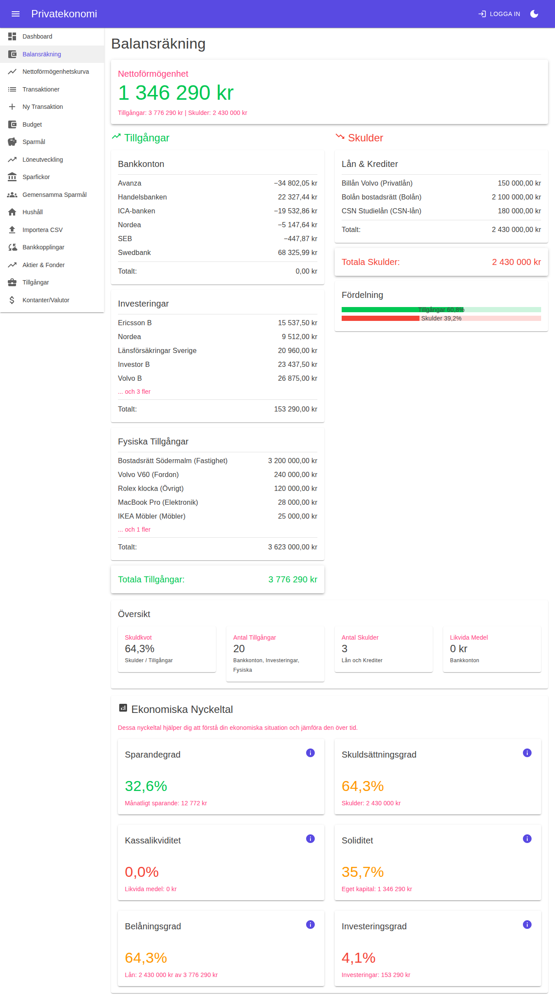

**Funktioner som visas:**
- 💰 Nettoförmögenhet (stor rubrik):
  - Huvudsaklig siffra i grönt
  - Undertext med tillgångar och skulder
- 📊 Tillgångar:
  - **Bankkonton**: Lista över alla bankkonton med saldo
  - **Investeringar**: Lista över aktier och fonder med värde
  - **Fysiska Tillgångar**: Fastigheter, fordon, övrigt
  - Totalsumma för varje kategori
  - Totala tillgångar (summa)
- 📉 Skulder:
  - **Lån & Krediter**: Lista över alla lån med belopp
  - Totalsumma
  - Progress bar visar fördelning tillgångar vs skulder
- 📈 Översikt:
  - Skuldkvot (%)
  - Antal Tillgångar
  - Antal Skulder
  - Likvida Medel
- 🎯 Ekonomiska Nyckeltal:
  - **Sparandegrad**: Procent av inkomst som sparas
  - **Skuldsättningsgrad**: Skulder i förhållande till tillgångar
  - **Kassalikviditet**: Likvida medel i procent
  - **Soliditet**: Eget kapital i förhållande till tillgångar
  - **Belåningsgrad**: Lån i förhållande till tillgångar
  - **Investeringsgrad**: Investeringar i förhållande till tillgångar
  - Info-knappar för förklaring av varje nyckeltal

**Viktiga funktioner:**
- **Realtidsöversikt**: Automatiskt uppdaterad balansräkning
- **Nyckeltal**: Viktiga ekonomiska indikatorer
- **Färgkodning**: Grön för tillgångar, röd för skulder
- **Hierarkisk visning**: Gruppering efter typ av tillgång/skuld
- **Detaljerad information**: Klickbara element för mer detaljer

---

## Nettoförmögenhetskurva

Visualisering av din ekonomiska utveckling över tid.

### Förmögenhetsutveckling
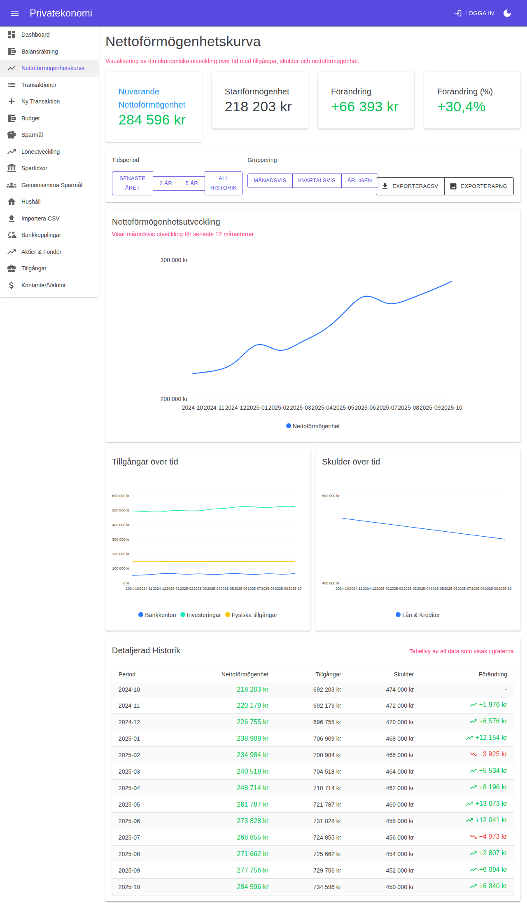

**Funktioner som visas:**
- 💰 Översikt:
  - Nuvarande Nettoförmögenhet
  - Startförmögenhet
  - Förändring i kronor (grönt för ökning)
  - Förändring i procent
- ⏱️ Tidsperiod (knappar):
  - Senaste året
  - 2 år
  - 5 år
  - All historik
- 📊 Gruppering (knappar):
  - Månadsvis
  - Kvartalsvis
  - Årligen
- 📥 Export:
  - Exportera data som CSV
  - Exportera graf som PNG
- 📈 Huvudgraf:
  - Linjediagram över nettoförmögenhetsutveckling
  - X-axel: Tidpunkt (månad/år)
  - Y-axel: Belopp i kronor
  - Interaktiv graf med hover-information
- 📊 Delgrafer:
  - **Tillgångar över tid**: Staplad graf med bankkonton, investeringar, fysiska tillgångar
  - **Skulder över tid**: Linjegraf med lån och krediter
- 📋 Detaljerad Historik:
  - Tabell med alla månader/perioder
  - Kolumner: Period, Nettoförmögenhet, Tillgångar, Skulder, Förändring
  - Ikoner för ökning/minskning i förändring

**Viktiga funktioner:**
- **Långsiktig övervakning**: Spåra ekonomisk utveckling över tid
- **Flexibel visning**: Välj tidsperiod och gruppering
- **Export**: Dela eller analysera data i andra verktyg
- **Detaljerad historik**: Se exakta siffror för varje period
- **Visuell återkoppling**: Färgkodade indikatorer för ökning/minskning

---

## Riktlinjer för uppdatering

### När ska screenshots uppdateras?

Screenshots bör uppdateras när:
- ✨ Nya funktioner läggs till i gränssnittet
- 🎨 Stora UI/UX-förändringar görs
- 🐛 Visuella buggar fixas som påverkar utseendet
- 📱 Responsiv design förbättras
- 🌓 Dark mode-implementationen uppdateras

### Hur tar man nya screenshots?

#### Automatisk metod (rekommenderas)

1. Se till att applikationen körs lokalt:
   ```bash
   cd src/Privatekonomi.Web
   dotnet run
   ```

2. Använd Playwright för att ta screenshots:
   ```bash
   # Navigera till projektroten
   cd /path/to/Privatekonomi
   
   # Ta screenshots med Playwright browser tool
   # eller använd ett anpassat script
   ```

3. Spara screenshots i `docs/screenshots/` med beskrivande namn:
   - `[sida]-light.png` för ljust läge
   - `[sida]-dark.png` för mörkt läge
   
   Exempel:
   - `dashboard-light.png`
   - `dashboard-dark.png`
   - `transactions-light.png`
   - `budgets-light.png`

#### Manuell metod

1. Starta applikationen:
   ```bash
   cd src/Privatekonomi.AppHost
   dotnet run
   ```

2. Öppna webbläsaren på `http://localhost:5274`

3. Navigera till önskad sida

4. Ta screenshot med:
   - **Windows**: `Win + Shift + S`
   - **Mac**: `Cmd + Shift + 4`
   - **Linux**: `Print Screen` eller `Shift + Print Screen`

5. Spara bilden i `docs/screenshots/` med beskrivande namn

6. Uppdatera `SCREENSHOTS.md` med den nya bilden

### Checklista för screenshot-uppdatering

- [ ] Ta screenshot i ljust läge (om relevant)
- [ ] Ta screenshot i mörkt läge (om relevant)
- [ ] Kontrollera att screenshots är i fullskärmsläge
- [ ] Verifiera att alla UI-element är synliga
- [ ] Uppdatera `SCREENSHOTS.md` med nya bilder
- [ ] Lägg till beskrivningar av nya funktioner
- [ ] Commit och push ändringarna
- [ ] Tagga commit med `[docs]` prefix

### Best practices

1. **Kvalitet**: Använd hög upplösning (minst 1920x1080)
2. **Konsistens**: Använd samma testdata för alla screenshots
3. **Fullständighet**: Visa alla relevanta UI-element
4. **Aktualitet**: Uppdatera screenshots inom 1 vecka efter UI-ändringar
5. **Dokumentation**: Inkludera beskrivande text för varje screenshot
6. **Organisation**: Använd tydlig och konsekvent namngivning

### Filstruktur

```
Privatekonomi/
├── docs/
│   └── screenshots/
│       ├── dashboard-light.png
│       ├── dashboard-dark.png
│       ├── transactions-light.png
│       ├── transactions-dark.png
│       ├── budgets-light.png
│       ├── goals-light.png
│       ├── investments-light.png
│       ├── categories-light.png
│       ├── import-light.png
│       ├── loans-light.png
│       ├── loans-dark.png
│       ├── salary-history-light.png
│       └── ... (andra screenshots)
└── SCREENSHOTS.md (detta dokument)
```

---

## Kontakt

För frågor eller förslag om dokumentationen, öppna en issue på GitHub:
https://github.com/pownas/Privatekonomi/issues

---

**Licens:** Detta projekt och dess dokumentation är licensierad under samma villkor som huvudprojektet.
