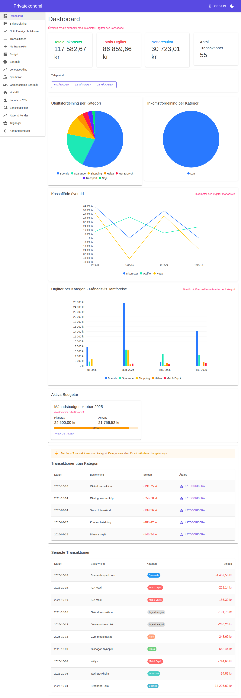
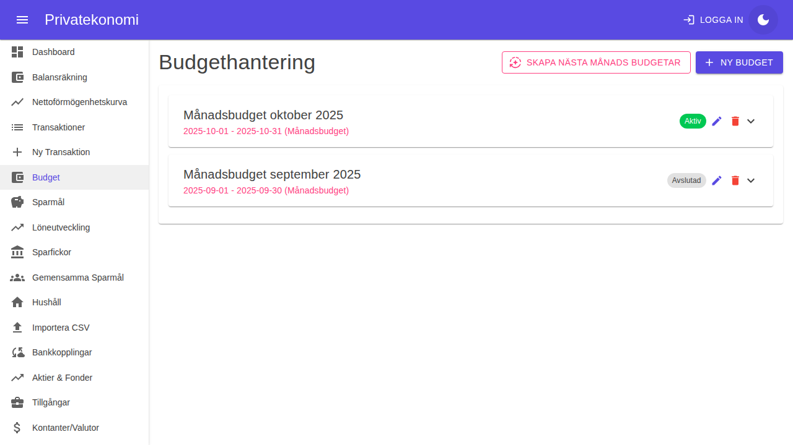

# Privatekonomi - Screenshot Documentation

Detta dokument innehåller screenshots av alla huvudfunktioner i Privatekonomi-applikationen. Dokumentationen uppdateras löpande när gränssnittet förändras.

**Senast uppdaterad:** 2025-10-24

---

## 📋 Innehållsförteckning

1. [Dashboard](#dashboard)
2. [Transaktioner](#transaktioner)
3. [Budget](#budget)
4. [Lån & Krediter](#lån--krediter)
5. [Löneutveckling](#löneutveckling)
6. [Sparmål](#sparmål)
7. [Investeringar](#investeringar)
8. [Kategorier](#kategorier)
9. [Import](#import)
10. [Skattedeklaration](#skattedeklaration)
11. [Riktlinjer för uppdatering](#riktlinjer-för-uppdatering)

---

## Dashboard

Dashboard ger en översikt över din ekonomi med inkomster, utgifter, kassaflöde och visualiseringar.

### Ljust läge


**Funktioner som visas:**
- 💰 Totala inkomster, utgifter och nettoresultat
- 📊 Cirkeldiagram för utgifts- och inkomstfördelning per kategori
- 📈 Linjediagram för kassaflöde över tid
- 📊 Stapeldiagram för utgifter per kategori månadsvis
- 📋 Aktiva budgetar med progress bar
- ⚠️ Transaktioner utan kategori
- 📝 Senaste transaktioner

### Mörkt läge


**Funktioner i mörkt läge:**
- Samma funktioner som ljust läge med anpassad färgpalett
- Högre kontrast för bättre läsbarhet i mörka miljöer
- WCAG 2.1 Nivå AA compliance

---

## Transaktioner

Hantera alla dina transaktioner med sökning, filtrering och export.

### Transaktionslista


**Funktioner som visas:**
- 📝 Ny Transaktion - knapp för att lägga till transaktion
- 📥 Exportera CSV - exportera transaktioner till CSV-format
- 📥 Exportera JSON - exportera transaktioner till JSON-format
- 🔍 Sökfunktion för att filtrera transaktioner
- 🏠 Filtrera efter hushåll
- 📋 Transaktionstabell med kolumner:
  - Datum
  - Beskrivning
  - Bank (färgkodade chips)
  - Hushåll
  - Kategori (färgkodade chips)
  - Belopp (grönt för inkomster, rött för utgifter)
  - Åtgärder (redigera och ta bort)

**Viktiga funktioner:**
- **Split-kategorisering**: Möjlighet att dela upp transaktioner i flera kategorier
- **Automatisk kategorisering**: Regelbaserad kategorisering med 44+ förkonfigurerade regler
- **Okategoriserad markering**: Tydlig indikation på transaktioner utan kategori
- **Multi-kategori visning**: Flera kategori-chips för delade transaktioner

---

## Budget

Skapa och följ upp budgetar med visualisering av planerat vs faktiskt utfall.

### Budgetöversikt


**Funktioner som visas:**
- 📅 Skapa Nästa Månads Budgetar - automatisk kopiering av budgetar
- ➕ Ny Budget - skapa anpassad budget
- 📊 Budget-kort med:
  - Budgetnamn och period
  - Status (Aktiv/Avslutad)
  - Planerat belopp
  - Använt belopp
  - Progress bar med procent
  - Åtgärder (redigera, ta bort, visa detaljer)

**Budgettyper:**
- Månadsbudget
- Årsbudget
- Anpassad period

---

## Lån & Krediter

Hantera och följ upp alla lån och krediter med amorteringsplan.

### Lånöversikt


**Funktioner som visas:**
- 💳 Sammanfattning:
  - Total Belåning (röd text)
  - Total Månadskostnad
  - Antal Lån/Krediter
  - Skuldfri Datum (grön text)
- 📊 Flikar:
  - **Översikt** - lista över alla lån
  - **Amorteringsplan** - detaljerad amorteringsplan
  - **Avbetalningsstrategier** - optimering av avbetalning
- 📋 Låntabell med:
  - Namn
  - Typ (Bolån, Privatlån, CSN-lån)
  - Belopp
  - Ränta
  - Amortering/månad
  - Månadskostnad
  - Extra info (t.ex. bindningstid)
  - Åtgärder

**Låntyper som stöds:**
- 🏠 Bolån
- 🚗 Privatlån (billån, etc.)
- 🎓 CSN-lån
- 💳 Kreditkort
- 📝 Anpassade lån

---

## Löneutveckling

Spåra och följa din löneutveckling över tid.

### Lönehistorik


**Funktioner som visas:**
- 💼 Sammanfattning:
  - Nuvarande Lön
  - Genomsnitt (12 månader)
  - Tillväxt (12 månader) i procent
  - Antal Poster
- 📈 Interaktiv graf:
  - Visualisering av löneutveckling över tid
  - Spåra hela karriären (50+ år support)
- 📋 Lönehistorik-tabell:
  - Period
  - Månadslön
  - Befattning
  - Arbetsgivare
  - Anställningstyp
  - Tjänstegrad (%)
  - Nuvarande (markerad)
  - Åtgärder
- 🔍 Sökfunktion i historiken

**Användningsområden:**
- Dokumentera jobbbyten
- Spåra löneförhöjningar
- Beräkna genomsnittslön
- Analysera lönetillväxt

---

## Sparmål

_Screenshots kommer att läggas till när sidan är tillgänglig_

Hantera personliga och gemensamma sparmål.

**Planerade funktioner att dokumentera:**
- Skapa och hantera sparmål
- Målbelopp och tidsgräns
- Prioritering av mål
- Visualisering av framsteg
- Gemensamma sparmål med andra användare
- Inbjudningssystem
- Förslagssystem med demokratiska ändringar

---

## Investeringar

_Screenshots kommer att läggas till när sidan är tillgänglig_

Hantera aktier, fonder och certifikat.

**Planerade funktioner att dokumentera:**
- Översikt över investeringar
- Automatisk kursuppdatering via Yahoo Finance API
- Import från Avanza Bank
- Export till CSV
- Värde och avkastning
- Bank och konto-filtrering

---

## Kategorier

_Screenshots kommer att läggas till när sidan är tillgänglig_

Hantera och organisera utgifts- och inkomstkategorier.

**Planerade funktioner att dokumentera:**
- Förkonfigurerade kategorier
- Färgkodning
- Hierarkisk struktur
- Kategoriöversikt
- Kategorisammanfattning
- Kategoriseringsregler (44+ förkonfigurerade)
- Regeltyper: innehåller, exakt, börjar med, slutar med, regex

---

## Import

_Screenshots kommer att läggas till när sidan är tillgänglig_

Importera transaktioner och investeringar från banker.

**Planerade funktioner att dokumentera:**
- CSV-import från ICA-banken
- CSV-import från Swedbank
- CSV-import från Avanza (investeringar)
- Automatisk dubblettdetektion
- Förhandsvisning innan import
- Detaljerad sammanfattning efter import

---

## Skattedeklaration

_Screenshots kommer att läggas till när sidan är tillgänglig_

Sverige-specifika skattefunktioner.

**Planerade funktioner att dokumentera:**
- ROT/RUT-avdrag
- K4 Kapitalvinster
- ISK/KF schablonbeskattning
- SIE-export för bokföring
- Reseavdrag

---

## Riktlinjer för uppdatering

### När ska screenshots uppdateras?

Screenshots bör uppdateras när:
- ✨ Nya funktioner läggs till i gränssnittet
- 🎨 Stora UI/UX-förändringar görs
- 🐛 Visuella buggar fixas som påverkar utseendet
- 📱 Responsiv design förbättras
- 🌓 Dark mode-implementationen uppdateras

### Hur tar man nya screenshots?

#### Automatisk metod (rekommenderas)

1. Se till att applikationen körs lokalt:
   ```bash
   cd src/Privatekonomi.Web
   dotnet run
   ```

2. Använd Playwright för att ta screenshots:
   ```bash
   # Navigera till projektroten
   cd /path/to/Privatekonomi
   
   # Ta screenshots med Playwright browser tool
   # eller använd ett anpassat script
   ```

3. Spara screenshots i `docs/screenshots/` med beskrivande namn:
   - `[sida]-light.png` för ljust läge
   - `[sida]-dark.png` för mörkt läge
   
   Exempel:
   - `dashboard-light.png`
   - `dashboard-dark.png`
   - `transactions-light.png`
   - `budgets-light.png`

#### Manuell metod

1. Starta applikationen:
   ```bash
   cd src/Privatekonomi.AppHost
   dotnet run
   ```

2. Öppna webbläsaren på `http://localhost:5274`

3. Navigera till önskad sida

4. Ta screenshot med:
   - **Windows**: `Win + Shift + S`
   - **Mac**: `Cmd + Shift + 4`
   - **Linux**: `Print Screen` eller `Shift + Print Screen`

5. Spara bilden i `docs/screenshots/` med beskrivande namn

6. Uppdatera `SCREENSHOTS.md` med den nya bilden

### Checklista för screenshot-uppdatering

- [ ] Ta screenshot i ljust läge (om relevant)
- [ ] Ta screenshot i mörkt läge (om relevant)
- [ ] Kontrollera att screenshots är i fullskärmsläge
- [ ] Verifiera att alla UI-element är synliga
- [ ] Uppdatera `SCREENSHOTS.md` med nya bilder
- [ ] Lägg till beskrivningar av nya funktioner
- [ ] Commit och push ändringarna
- [ ] Tagga commit med `[docs]` prefix

### Best practices

1. **Kvalitet**: Använd hög upplösning (minst 1920x1080)
2. **Konsistens**: Använd samma testdata för alla screenshots
3. **Fullständighet**: Visa alla relevanta UI-element
4. **Aktualitet**: Uppdatera screenshots inom 1 vecka efter UI-ändringar
5. **Dokumentation**: Inkludera beskrivande text för varje screenshot
6. **Organisation**: Använd tydlig och konsekvent namngivning

### Filstruktur

```
Privatekonomi/
├── docs/
│   └── screenshots/
│       ├── dashboard-light.png
│       ├── dashboard-dark.png
│       ├── transactions-light.png
│       ├── transactions-dark.png
│       ├── budgets-light.png
│       ├── goals-light.png
│       ├── investments-light.png
│       ├── categories-light.png
│       ├── import-light.png
│       ├── loans-light.png
│       ├── loans-dark.png
│       ├── salary-history-light.png
│       └── ... (andra screenshots)
└── SCREENSHOTS.md (detta dokument)
```

---

## Kontakt

För frågor eller förslag om dokumentationen, öppna en issue på GitHub:
https://github.com/pownas/Privatekonomi/issues

---

**Licens:** Detta projekt och dess dokumentation är licensierad under samma villkor som huvudprojektet.
