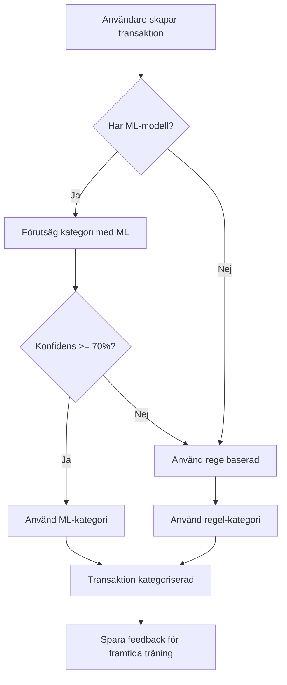

# ML-baserad Smart Kategorisering

> **Implementerad:** Oktober 2025  
> **Status:** ✅ Produktionsklar  
> **Version:** 1.0

## Översikt

ML-baserad smart kategorisering använder maskininlärning (ML.NET) för att automatiskt kategorisera transaktioner baserat på användarens tidigare kategoriseringsmönster. Systemet lär sig från användarens egna data och förbättras över tid genom kontinuerlig feedback.

### Huvudfunktioner

- 🤖 **Användarspecifik inlärning** - Varje användare får sin egen ML-modell tränad på sina transaktioner
- 📊 **Konfidensbedömning** - Varje förutsägelse kommer med ett konfidenspoäng (0-100%)
- 🔄 **Automatisk fallback** - Faller tillbaka till regelbaserad kategorisering vid låg konfidens
- 📈 **Kontinuerlig förbättring** - Lär sig från användarens korrigeringar
- 🔒 **Integritetsfokus** - Ingen datadelning mellan användare

## Innehållsförteckning

1. [Hur det fungerar](#hur-det-fungerar)
2. [Teknisk implementation](#teknisk-implementation)
3. [Träningskrav](#träningskrav)
4. [API-användning](#api-användning)
5. [Datamodell](#datamodell)
6. [Prestanda](#prestanda)
7. [Felsökning](#felsökning)
8. [Säkerhet och integritet](#säkerhet-och-integritet)

---

## Hur det fungerar

### Arbetsflöde



### Steg-för-steg

1. **Transaktion skapas** - När en ny transaktion skapas utan kategori
2. **ML-försök** - Systemet försöker först med ML-förutsägelse (om modell finns)
3. **Konfidensbedömning** - Om konfidensen är ≥70% används ML-kategorin
4. **Fallback** - Vid låg konfidens eller ingen modell används regelbaserad kategorisering
5. **Feedback** - Användarens val (eller korrigering) sparas för framtida modelförbättring

### Exempel på användning

#### Scenario 1: Hög konfidens
```
Input: "ICA Supermarket Stockholm - 285 kr"
ML Output:
  - Kategori: Mat & Dryck
  - Konfidens: 92%
  - Åtgärd: ✓ Acceptera automatiskt
```

#### Scenario 2: Låg konfidens
```
Input: "Gekås Ullared - 1,250 kr"
ML Output:
  - Kategori: Shopping (45%), Kläder (30%), Mat (25%)
  - Konfidens: 45%
  - Åtgärd: ? Använd regelbaserad eller fråga användare
```

---

## Teknisk implementation

### Arkitektur

```
┌─────────────────────────────────────────────────────────────┐
│                  TransactionService                         │
│                                                             │
│  CreateTransactionAsync()                                   │
│    ├─> 1. Try ML Prediction (ITransactionMLService)       │
│    │     ├─> Check confidence >= 70%                       │
│    │     └─> Return category if confident                  │
│    │                                                        │
│    └─> 2. Fallback to Rule-Based (ICategoryRuleService)   │
│          └─> Apply predefined rules                        │
└─────────────────────────────────────────────────────────────┘

┌─────────────────────────────────────────────────────────────┐
│                  TransactionMLService                        │
│                                                             │
│  - TrainModelAsync()      - Träna ny modell                │
│  - PredictCategoryAsync() - Förutsäg kategori              │
│  - EvaluateModelAsync()   - Utvärdera modell               │
│  - UpdateFeedbackAsync()  - Spara feedback                 │
└─────────────────────────────────────────────────────────────┘

┌─────────────────────────────────────────────────────────────┐
│                     ML.NET Pipeline                          │
│                                                             │
│  Text Features:                                             │
│    - N-gram tokenisering av beskrivning                    │
│    - Normalisering och cleaning                            │
│                                                             │
│  Numeriska Features:                                        │
│    - Belopp (amount)                                        │
│    - Log-transformerat belopp (log scale)                  │
│    - Veckodag (1-7)                                         │
│    - Dag i månad (1-31)                                     │
│                                                             │
│  Kategoriska Features:                                      │
│    - Helg (ja/nej)                                          │
│    - Månadstart (första 5 dagarna)                         │
│    - Månadslut (sista 5 dagarna)                           │
│                                                             │
│  Algorithm: SDCA (Stochastic Dual Coordinate Ascent)       │
│  Train/Test Split: 80/20                                   │
└─────────────────────────────────────────────────────────────┘
```

### Projektstruktur

```
src/Privatekonomi.Core/
├── ML/
│   ├── ITransactionMLService.cs       # Service interface
│   ├── TransactionMLService.cs        # ML.NET implementation
│   └── TransactionMLModels.cs         # Feature & prediction models
├── Models/
│   ├── MLModel.cs                     # Database entity för modeller
│   └── UserFeedback.cs                # Feedback tracking
└── Services/
    └── TransactionService.cs          # Integration point

tests/Privatekonomi.Core.Tests/
└── TransactionMLServiceTests.cs       # Unit tests (9 tests)
```

### Teknologier

- **ML.NET 3.0.1** - Microsofts ML-ramverk för .NET
- **SDCA Algorithm** - Stochastic Dual Coordinate Ascent för multi-class classification
- **Entity Framework Core** - För databaspersistens
- **xUnit** - För enhetstester

---

## Träningskrav

### Minimikrav (Hårdkodade)

För att träna en ML-modell krävs:

- **Minst 50 kategoriserade transaktioner** per användare
- **Minst 5 exempel per kategori** som ska inkluderas i träningen
- Kategorier med färre än 5 exempel exkluderas automatiskt

### Optimala förhållanden

För bästa prestanda rekommenderas:

- **200+ transaktioner** för bättre precision
- **Jämn fördelning** över kategorier (undvik extrem obalans)
- **Historik över 3+ månader** för temporala mönster
- **Varierad data** (olika belopp, dagar, beskrivningar)

### Träningsprocess

```csharp
// Automatisk träning kan initieras så här:
var mlService = serviceProvider.GetRequiredService<ITransactionMLService>();
var userId = "user-123";

// Träna modell
var metrics = await mlService.TrainModelAsync(userId);

if (metrics != null)
{
    Console.WriteLine($"Modell tränad!");
    Console.WriteLine($"Accuracy: {metrics.Accuracy:P2}");
    Console.WriteLine($"Precision: {metrics.MacroPrecision:P2}");
    Console.WriteLine($"Recall: {metrics.MacroRecall:P2}");
    Console.WriteLine($"Log Loss: {metrics.LogLoss:F4}");
}
else
{
    Console.WriteLine("Otillräcklig data för träning.");
}
```

---

## API-användning

### Interface: ITransactionMLService

```csharp
public interface ITransactionMLService
{
    // Träning
    Task<ModelMetrics?> TrainModelAsync(string userId);
    Task<ModelMetrics?> EvaluateModelAsync(string userId);
    
    // Förutsägelse
    Task<CategoryPrediction?> PredictCategoryAsync(
        Transaction transaction, 
        string userId);
    
    Task<List<CategoryPrediction>> PredictBatchAsync(
        List<Transaction> transactions, 
        string userId);
    
    // Modellhantering
    Task SaveModelAsync(string userId, string modelPath);
    Task LoadModelAsync(string userId);
    Task<bool> IsModelTrainedAsync(string userId);
    
    // Feedback
    Task UpdateModelWithFeedbackAsync(
        string userId,
        Transaction transaction,
        string correctCategory,
        string predictedCategory,
        float confidence);
}
```

### Exempel: Förutsägelse

```csharp
// Inject service
private readonly ITransactionMLService _mlService;

public async Task<string> CategorizeTransaction(Transaction transaction)
{
    var userId = transaction.UserId;
    
    // Försök ML-förutsägelse
    var prediction = await _mlService.PredictCategoryAsync(transaction, userId);
    
    if (prediction != null)
    {
        if (!prediction.IsUncertain) // Confidence >= 70%
        {
            // Hög konfidens - använd ML-kategori
            return prediction.Category;
        }
        else
        {
            // Låg konfidens - visa alternativ
            var alternatives = string.Join(", ", 
                prediction.AlternativeCategories
                    .Select(kvp => $"{kvp.Key} ({kvp.Value:P0})"));
            
            Console.WriteLine($"Osäker: {alternatives}");
        }
    }
    
    // Fallback till regelbaserad
    return await ApplyRuleBasedCategorization(transaction);
}
```

### Exempel: Feedback

```csharp
// När användare korrigerar en kategori
public async Task RecordFeedback(
    Transaction transaction,
    string predictedCategory,
    string actualCategory,
    float confidence)
{
    await _mlService.UpdateModelWithFeedbackAsync(
        transaction.UserId,
        transaction,
        actualCategory,      // Vad användaren valde
        predictedCategory,   // Vad ML föreslog
        confidence           // Konfidensen från ML
    );
    
    // Feedback sparas i UserFeedback-tabellen
    // Kan användas för framtida omträning
}
```

---

## Datamodell

### MLModel - Sparar tränad modell

```csharp
public class MLModel
{
    public int ModelId { get; set; }
    public string UserId { get; set; }              // FK till ApplicationUser
    public string ModelPath { get; set; }           // Sökväg till .zip-fil på disk
    public DateTime TrainedAt { get; set; }         // När modellen tränades
    public int TrainingRecordsCount { get; set; }   // Antal transaktioner
    public float Accuracy { get; set; }             // Modellens accuracy (0-1)
    public float Precision { get; set; }            // Precision (0-1)
    public float Recall { get; set; }               // Recall (0-1)
    public string? Metrics { get; set; }            // JSON med detaljerad metrics
    
    // Navigation
    public ApplicationUser? User { get; set; }
}
```

**Databaskonfiguration:**
```csharp
modelBuilder.Entity<MLModel>(entity =>
{
    entity.HasKey(e => e.ModelId);
    entity.Property(e => e.UserId).IsRequired().HasMaxLength(450);
    entity.Property(e => e.ModelPath).IsRequired().HasMaxLength(500);
    entity.Property(e => e.Metrics).HasMaxLength(2000);
    
    entity.HasOne(e => e.User)
        .WithMany()
        .HasForeignKey(e => e.UserId)
        .OnDelete(DeleteBehavior.Cascade);
    
    entity.HasIndex(e => e.UserId);
});
```

### UserFeedback - Spårar förutsägelser och korrigeringar

```csharp
public class UserFeedback
{
    public int FeedbackId { get; set; }
    public string UserId { get; set; }              // FK till ApplicationUser
    public int TransactionId { get; set; }          // FK till Transaction
    public string PredictedCategory { get; set; }   // Vad ML föreslog
    public float PredictedConfidence { get; set; }  // Konfidens (0-1)
    public string ActualCategory { get; set; }      // Vad användaren valde
    public bool WasCorrectionNeeded { get; set; }   // Om användaren ändrade
    public DateTime FeedbackDate { get; set; }      // Tidstämpel
    
    // Navigation
    public ApplicationUser? User { get; set; }
    public Transaction? Transaction { get; set; }
}
```

**Databaskonfiguration:**
```csharp
modelBuilder.Entity<UserFeedback>(entity =>
{
    entity.HasKey(e => e.FeedbackId);
    entity.Property(e => e.UserId).IsRequired().HasMaxLength(450);
    entity.Property(e => e.PredictedCategory).IsRequired().HasMaxLength(100);
    entity.Property(e => e.ActualCategory).IsRequired().HasMaxLength(100);
    
    entity.HasOne(e => e.User)
        .WithMany()
        .HasForeignKey(e => e.UserId)
        .OnDelete(DeleteBehavior.Cascade);
    
    entity.HasOne(e => e.Transaction)
        .WithMany()
        .HasForeignKey(e => e.TransactionId)
        .OnDelete(DeleteBehavior.Cascade);
    
    entity.HasIndex(e => e.UserId);
    entity.HasIndex(e => e.TransactionId);
    entity.HasIndex(e => e.FeedbackDate);
});
```

### Feature Models

```csharp
// Input för ML-träning och förutsägelse
public class TransactionFeatures
{
    public string Description { get; set; }  // Transaktionsbeskrivning
    public string Payee { get; set; }        // Mottagare (om tillgängligt)
    public float Amount { get; set; }        // Belopp
    public float AmountLog { get; set; }     // Log-transformerat belopp
    public float DayOfWeek { get; set; }     // Veckodag (1-7)
    public float DayOfMonth { get; set; }    // Dag i månad (1-31)
    public bool IsWeekend { get; set; }      // Helg?
    public bool IsMonthStart { get; set; }   // Månadstart?
    public bool IsMonthEnd { get; set; }     // Månadslut?
    public string Category { get; set; }     // Målkategori (för träning)
}

// Output från ML-förutsägelse
public class CategoryPrediction
{
    public string Category { get; set; }     // Föreslagen kategori
    public float Confidence { get; set; }    // Konfidens (0-1)
    public bool IsUncertain => Confidence < 0.7f;  // Osäker?
    public Dictionary<string, float> AlternativeCategories { get; set; }
}

// Metrics från modellutvärdering
public class ModelMetrics
{
    public double Accuracy { get; set; }
    public double MacroPrecision { get; set; }
    public double MacroRecall { get; set; }
    public double MicroAccuracy { get; set; }
    public double LogLoss { get; set; }
    public double LogLossReduction { get; set; }
}
```

---

## Prestanda

### Målvärden

| Metrik | Målvärde | Beskrivning |
|--------|----------|-------------|
| **Accuracy** | >85% | Andel korrekta förutsägelser |
| **Precision** | >80% | Andel av förutsagda positiva som är korrekta |
| **Recall** | >80% | Andel av faktiska positiva som hittas |
| **Latency** | <100ms | Tid för en förutsägelse |
| **Confidence** | 90% | Andel högkonfidens-förutsägelser som är korrekta |

### Prestandaoptimering

1. **Modellcaching** - Tränade modeller cachas i minnet för snabbare förutsägelser
2. **Lazy Loading** - Modeller laddas endast när de behövs
3. **Batch Processing** - Stöd för att förutsäga flera transaktioner samtidigt
4. **Effektiv feature extraction** - Optimerad textprocessing med n-grams

### Minnesanvändning

- **Modell på disk**: ~1-5 MB per användare (beroende på träningsdata)
- **Modell i minne**: ~2-10 MB per cachad modell
- **Rekommendation**: Rensa cache regelbundet för inaktiva användare

---

## Felsökning

### Vanliga problem

#### Problem: "Insufficient training data"

**Symptom:** `TrainModelAsync` returnerar `null`

**Orsak:** Användaren har färre än 50 kategoriserade transaktioner

**Lösning:**
```csharp
var transactionCount = await _context.Transactions
    .Where(t => t.UserId == userId && t.TransactionCategories.Any())
    .CountAsync();

if (transactionCount < 50)
{
    // Visa meddelande till användare
    return "Du behöver minst 50 kategoriserade transaktioner för ML-träning.";
}
```

#### Problem: Modellen finns inte

**Symptom:** `PredictCategoryAsync` returnerar `null`

**Orsak:** Ingen modell har tränats för användaren

**Lösning:**
```csharp
var hasModel = await _mlService.IsModelTrainedAsync(userId);
if (!hasModel)
{
    // Träna modell eller använd fallback
    await _mlService.TrainModelAsync(userId);
}
```

#### Problem: Låg accuracy

**Symptom:** Modellen gör många felaktiga förutsägelser

**Möjliga orsaker:**
- För få träningsexempel per kategori
- Obalanserad data (vissa kategorier har mycket fler exempel)
- Inkonsekvent kategorisering från användaren
- För bred variation i transaktionsbeskrivningar

**Lösningar:**
1. Vänta på mer träningsdata
2. Uppmuntra användaren till konsekvent kategorisering
3. Överväg att slå ihop liknande kategorier
4. Öka antalet träningsexempel

#### Problem: Långsam träning

**Symptom:** `TrainModelAsync` tar lång tid

**Orsak:** Många transaktioner eller komplex data

**Lösning:**
```csharp
// Träna asynkront i bakgrunden
_ = Task.Run(async () => 
{
    await _mlService.TrainModelAsync(userId);
});

// Eller schemalägg träning nattetid
```

### Loggning

Aktivera detaljerad loggning för felsökning:

```csharp
// I appsettings.json
{
  "Logging": {
    "LogLevel": {
      "Privatekonomi.Core.ML": "Debug"
    }
  }
}
```

Viktiga loggmeddelanden att titta efter:
- `Starting model training for user {UserId}`
- `Insufficient training data for user {UserId}`
- `Model training completed for user {UserId}. Accuracy: {Accuracy:P2}`
- `No trained model found for user {UserId}`

---

## Säkerhet och integritet

### Dataisolering

- **Användarspecifika modeller** - Varje användare har sin egen ML-modell
- **Ingen datadelning** - Transaktionsdata delas aldrig mellan användare
- **Lokal lagring** - Modeller lagras lokalt, inte i molnet

### GDPR-överensstämmelse

För att vara GDPR-kompatibel behöver systemet:

1. **Rätt till radering** - Implementera borttagning av modeller och feedback
```csharp
public async Task DeleteUserDataAsync(string userId)
{
    // Ta bort modeller
    var models = await _context.MLModels
        .Where(m => m.UserId == userId)
        .ToListAsync();
    
    foreach (var model in models)
    {
        // Ta bort modellfil från disk
        if (File.Exists(model.ModelPath))
        {
            File.Delete(model.ModelPath);
        }
    }
    
    _context.MLModels.RemoveRange(models);
    
    // Ta bort feedback
    var feedback = await _context.UserFeedbacks
        .Where(f => f.UserId == userId)
        .ToListAsync();
    
    _context.UserFeedbacks.RemoveRange(feedback);
    
    await _context.SaveChangesAsync();
}
```

2. **Rätt till export** - Exportera användardata
```csharp
public async Task<object> ExportUserMLDataAsync(string userId)
{
    var model = await _context.MLModels
        .FirstOrDefaultAsync(m => m.UserId == userId);
    
    var feedback = await _context.UserFeedbacks
        .Where(f => f.UserId == userId)
        .ToListAsync();
    
    return new
    {
        Model = model,
        Feedback = feedback,
        ExportedAt = DateTime.UtcNow
    };
}
```

3. **Opt-in/Opt-out** - Låt användare välja ML-funktionalitet

### Säkerhetsöverväganden

#### CodeQL-varningar

CodeQL har identifierat 5 "log forging" varningar relaterade till loggning av `userId`. 

**Bedömning:** Låg risk eftersom:
- `userId` kommer från autentiserad identitet (systemkontrollerad)
- Inte direkt användarinput
- Används endast i informations-/varningsloggar

**Rekommendation:** 
- Implementera log-sanitering på infrastrukturnivå om nödvändigt
- Överväg att använda strukturerad loggning:
```csharp
_logger.LogInformation(
    "Model training for user {UserId}", 
    SecurityHelper.SanitizeForLog(userId));
```

#### Modellsäkerhet

- **Validering** - Validera alltid modellens integritet före användning
- **Versionshantering** - Spåra modellversioner för återställning
- **Åtkomstkontroll** - Endast modellens ägare kan träna/använda den

---

## Framtida förbättringar

### Planerade funktioner

#### Fas 2: Automatisering
- [ ] Bakgrundstjänst för automatisk omträning (nattlig)
- [ ] Schemalagd träning baserad på antal nya transaktioner
- [ ] Automatisk modellvalidering och rollback vid försämring

#### Fas 3: Användarupplevelse
- [ ] Dashboard för modellmetrics i UI
- [ ] Visualisering av modellprestanda över tid
- [ ] Notifieringar vid låg modellprestanda
- [ ] Opt-in/opt-out kontroller i användarinställningar

#### Fas 4: Avancerad ML
- [ ] Deep learning (LSTM/Transformer) för bättre textförståelse
- [ ] Transfer learning från anonymiserad aggregerad data
- [ ] Multi-label klassificering för delade kategorier
- [ ] Anomalidetektion för ovanliga transaktioner

#### Fas 5: Integration
- [ ] REST API för extern åtkomst
- [ ] Webhook för modelluppdateringar
- [ ] Export av träningsdata för analys
- [ ] Import av kategoriseringsregler från andra system

---

## Support och bidrag

### Rapportera problem

Om du hittar buggar eller har förslag:
1. Skapa ett issue på GitHub
2. Inkludera relevant information (loggmeddelanden, transaktionsdata)
3. Beskriv förväntat vs faktiskt beteende

### Utvecklardokumentation

För utvecklare som vill bidra:
- Se `tests/Privatekonomi.Core.Tests/TransactionMLServiceTests.cs` för testexempel
- Följ befintliga kodkonventioner
- Skriv enhetstester för ny funktionalitet
- Uppdatera dokumentation

### Ytterligare resurser

- [ML.NET Documentation](https://docs.microsoft.com/en-us/dotnet/machine-learning/)
- [SDCA Algorithm](https://www.microsoft.com/en-us/research/publication/stochastic-dual-coordinate-ascent-methods-for-regularized-loss-minimization/)
- [Feature Engineering Best Practices](https://docs.microsoft.com/en-us/azure/machine-learning/how-to-engineer-features)

---

## Changelog

### Version 1.0 (Oktober 2025)
- ✅ Initial implementation med ML.NET 3.0.1
- ✅ SDCA multi-class classifier
- ✅ User-specific model training
- ✅ Confidence-based fallback
- ✅ Database entities (MLModel, UserFeedback)
- ✅ 9 comprehensive unit tests
- ✅ Integration med TransactionService
- ✅ Production-ready error handling

---

**Skapad:** 2025-10-30  
**Senast uppdaterad:** 2025-10-30  
**Författare:** Privatekonomi Development Team
