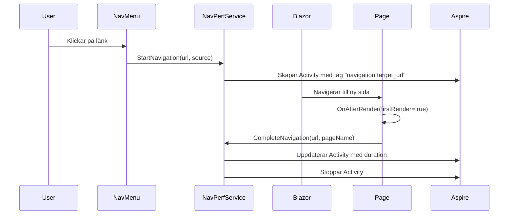

# Navigation Performance Tracking

## Översikt

Detta dokument beskriver hur navigation performance tracking fungerar i Privatekonomi-applikationen. Systemet spårar tiden från att användaren klickar på en länk i menyn till dess att målsidan är helt renderad.

## Arkitektur

### Komponenter

1. **NavigationPerformanceService** (`Privatekonomi.Core.Services`)
   - Hanterar spårning av navigationsmetriker
   - Använder .NET `ActivitySource` för telemetri
   - Tillhandahåller metoder för att starta, slutföra och avbryta navigationer

2. **NavMenu.razor** (`Privatekonomi.Web.Components.Layout`)
   - Lägger till `OnClick`-händelser på alla `MudNavLink`-komponenter
   - Anropar `NavigationPerformanceService.StartNavigation()` när användaren klickar

3. **PerformanceTrackedPageBase** (`Privatekonomi.Web.Components.Shared`)
   - Basklass för sidor som ska rapportera navigation completion
   - Anropar `NavigationPerformanceService.CompleteNavigation()` i `OnAfterRender()`

4. **NavigationPerformance.razor** (`Privatekonomi.Web.Components.Pages`)
   - Dashboard-sida för att visualisera navigationsmetriker i realtid
   - Visar aktiva och slutförda navigationer med statistik

## Hur det fungerar

### Flöde



### Spårade metriker

För varje navigation spåras följande:

- **navigation.target_url**: Målsidans URL
- **navigation.source**: Källa (t.ex. "NavMenu:Transaktioner")
- **navigation.page_name**: Sidans namn
- **navigation.duration_ms**: Tid från klick till render (millisekunder)
- **navigation.id**: Unikt ID för navigationen

## Användning

### För sidor: Ärv från PerformanceTrackedPageBase

Den enklaste metoden är att låta din sida ärva från `PerformanceTrackedPageBase`:

```razor
@page "/min-sida"
@inherits Privatekonomi.Web.Components.Shared.PerformanceTrackedPageBase

<PageTitle>Min Sida</PageTitle>

<MudContainer>
    <MudText Typo="Typo.h4">Min Sida</MudText>
</MudContainer>

@code {
    protected override string PageName => "Min Sida";
}
```

### Manuell spårning (alternativ metod)

Om din sida redan ärver från en annan basklass kan du manuellt spåra navigation:

```razor
@page "/min-sida"
@inject INavigationPerformanceService NavigationPerformanceService
@inject NavigationManager NavigationManager

@code {
    protected override void OnAfterRender(bool firstRender)
    {
        base.OnAfterRender(firstRender);
        
        if (firstRender)
        {
            var currentUrl = NavigationManager.ToBaseRelativePath(NavigationManager.Uri);
            var cleanUrl = CleanUrl(currentUrl);
            NavigationPerformanceService.CompleteNavigation(cleanUrl, "Min Sida");
        }
    }

    private static string CleanUrl(string url)
    {
        var queryIndex = url.IndexOf('?', StringComparison.Ordinal);
        if (queryIndex >= 0) url = url[..queryIndex];
        
        var fragmentIndex = url.IndexOf('#', StringComparison.Ordinal);
        if (fragmentIndex >= 0) url = url[..fragmentIndex];
        
        return url.Trim('/');
    }
}
```

### Lägga till nya menyalternativ

När du lägger till nya länkar i `NavMenu.razor`, glöm inte att lägga till `OnClick`-händelsen:

```razor
<MudNavLink Href="/ny-sida" 
            Icon="@Icons.Material.Filled.Star" 
            OnClick="@(() => TrackNavigation("/ny-sida", "Ny Sida"))">
    Ny Sida
</MudNavLink>
```

## Visualisering

### I applikationen

Besök `/navigation-performance` (endast synlig i Development-läge) för att se:

- **Aktiva navigeringar**: Pågående navigationer i realtid
- **Slutförda navigeringar**: Timeline med de senaste 10 navigationerna
- **Statistik**: Genomsnittlig, snabbaste och långsammaste navigation

### I Aspire Dashboard

1. Öppna Aspire Dashboard (vanligtvis https://localhost:17033)
2. Navigera till **Traces**
3. Filtrera på resource: `privatekonomi-web`
4. Sök efter traces med namnet `Navigation` eller `NavigationCompleted`
5. Klicka på en trace för att se detaljer:
   - Duration (total tid från klick till render)
   - Tags (URL, sidnamn, källa)
   - Spans (kan innehålla nested operations)

## Prestandamål

Baserat på best practices för web performance:

- **Utmärkt**: < 100 ms (grön)
- **Bra**: 100-300 ms (blå)
- **Acceptabel**: 300-500 ms (gul)
- **Långsam**: > 500 ms (röd)

Dessa färgkoder används i `/navigation-performance` dashboarden.

## Felsökning

### Navigation rapporteras inte

**Problem**: Klick i menyn spåras inte.

**Lösning**:
- Kontrollera att `INavigationPerformanceService` är registrerad i DI-containern (`Program.cs`)
- Verifiera att `OnClick`-händelsen finns på `MudNavLink` i `NavMenu.razor`

### Sidan rapporteras aldrig som färdig

**Problem**: Navigationen startar men CompleteNavigation anropas aldrig.

**Lösning**:
- Kontrollera att sidan antingen ärver från `PerformanceTrackedPageBase` eller manuellt anropar `CompleteNavigation()`
- Verifiera att URL:en matchar (glöm inte att rensa query strings och fragments)

### Felaktiga duration-värden

**Problem**: Duration är mycket högre än förväntat.

**Möjliga orsaker**:
- Långsamma databasfrågor i `OnInitializedAsync()`
- Stora datamängder som renderas i vyn
- API-anrop som blockerar renderingen
- Icke-optimerad Blazor Server reconnection

**Lösning**:
- Analysera traces i Aspire Dashboard för att hitta bottlenecks
- Använd virtualisering för stora listor (`<Virtualize>`)
- Flytta långvariga operationer till bakgrundstasks
- Optimera databasfrågor med proper indexing

## Framtida förbättringar

- [ ] Exportera metriker till persistent storage för långtidsanalys
- [ ] Lägg till percentiler (P50, P95, P99) i statistiken
- [ ] Skapa alerting för ovanligt långsamma navigationer
- [ ] Integrera med Application Insights eller liknande APM-verktyg
- [ ] Spåra client-side performance metrics (FCP, LCP, TTI)
- [ ] Lägg till user segmentation (olika användare kan ha olika performance)

## Relaterade dokument

- [ASPIRE_GUIDE.md](ASPIRE_GUIDE.md) - .NET Aspire integration
- [TELEMETRY_TRACKING.md](TELEMETRY_TRACKING.md) - Allmän telemetri-dokumentation (om den finns)

## Exempel på användning

Se följande filer för exempel:

- **Enkel implementation**: `src/Privatekonomi.Web/Components/Pages/TelemetryExample.razor`
- **Dashboard**: `src/Privatekonomi.Web/Components/Pages/NavigationPerformance.razor`
- **Service**: `src/Privatekonomi.Core/Services/NavigationPerformanceService.cs`
- **Basklass**: `src/Privatekonomi.Web/Components/Shared/PerformanceTrackedPageBase.cs`
