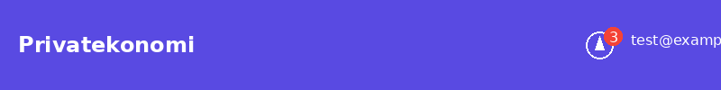
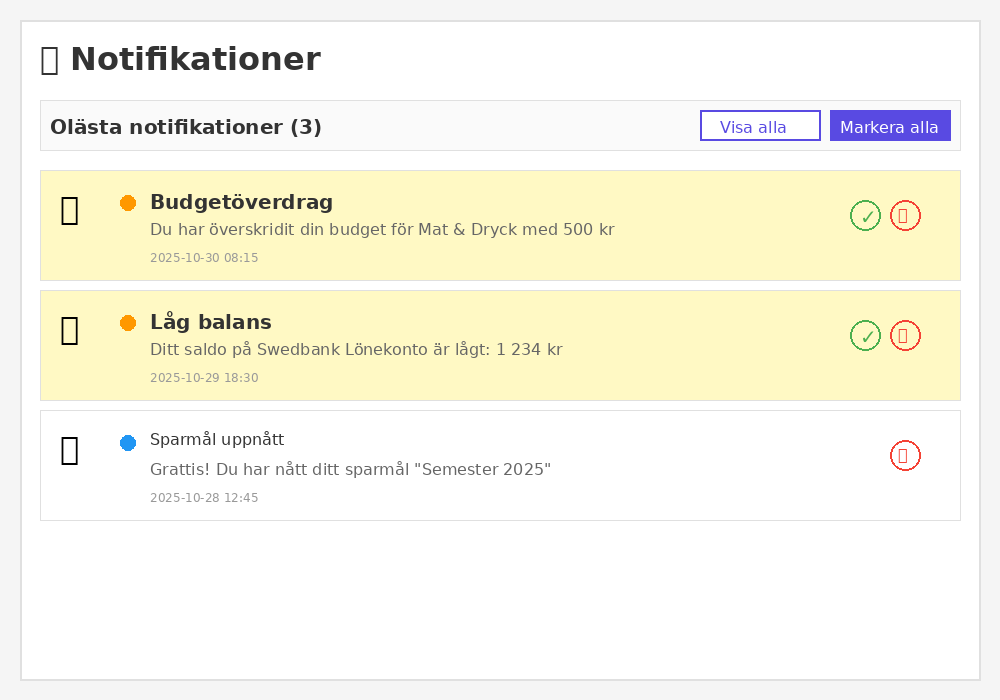
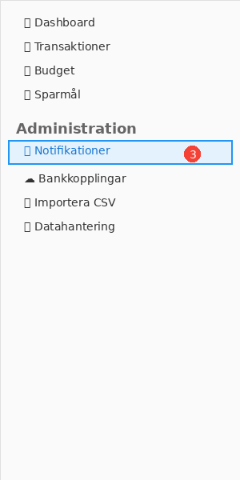
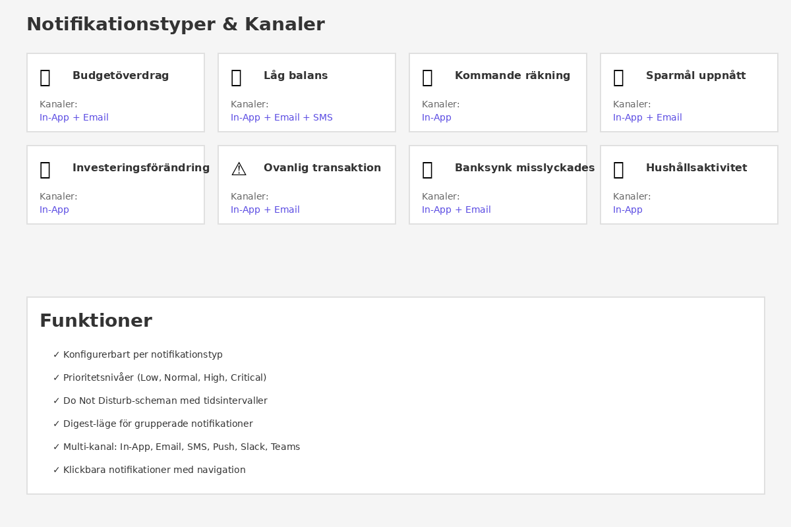

# Notifikationssystem - Visuell Guide

Detta dokument visar de nya UI-komponenter som har implementerats för notifikationssystemet.

## 1. Notifikationsklocka i App Bar



**Placering:** Högst upp i app bar, till höger om användarnamnet

**Funktioner:**
- 🔔 Klickbar klocka-ikon
- 🔴 Röd badge med antal olästa notifikationer
- Uppdateras automatiskt var 30:e sekund
- Navigerar till notifikationssidan när man klickar

**Implementation:**
```razor
<NotificationBell />
```

Komponenten finns i: `src/Privatekonomi.Web/Components/Layout/NotificationBell.razor`

---

## 2. Notifikationssida



**Sökväg:** `/notifications`

**Funktioner:**
- 📋 Lista över alla notifikationer
- 🔍 Filter: Visa alla eller endast olästa
- ✅ Markera som läst (enskild eller alla)
- 🗑️ Ta bort notifikationer
- 🎨 Visuell skillnad mellan lästa och olästa (bakgrundsfärg)
- 🎯 Klickbara notifikationer som navigerar till relaterad sida
- 🎨 Prioritetsfärger:
  - 🔴 Röd = Kritisk
  - 🟠 Orange = Hög
  - 🔵 Blå = Normal
  - 🟢 Grön = Låg

**Implementation:**
```razor
@page "/notifications"
```

Komponenten finns i: `src/Privatekonomi.Web/Components/Pages/Notifications.razor`

---

## 3. Navigation Menu



**Placering:** Vänster sidopanel under "Administration"

**Funktioner:**
- 🔔 Notifikationer-länk med badge
- 📊 Visar antal olästa i badge
- ✨ Highlightad när aktiv

**Integration:**
Notifikationslänken har lagts till i navigationsmenyn under Administration-sektionen.

---

## 4. Notifikationstyper & Kanaler



**20+ Notifikationstyper:**

### Budget & Ekonomi
- 📊 **Budgetöverdrag** - In-App + Email
- ⚠️ **Budgetvarning** - In-App
- 💰 **Låg balans** - In-App + Email + SMS (kritisk)

### Räkningar
- 📅 **Kommande räkning** - In-App
- 🔔 **Räkning förfaller** - In-App + Email
- ⏰ **Försenad räkning** - In-App + Email + SMS

### Sparmål
- 🎯 **Sparmål uppnått** - In-App + Email
- 📈 **Sparmål milstolpe** - In-App

### Investeringar
- 💹 **Investeringsförändring** - In-App
- ⬆️ **Stor vinst** - In-App + Email
- ⬇️ **Stor förlust** - In-App + Email

### Transaktioner
- ⚠️ **Ovanlig transaktion** - In-App + Email
- 💸 **Stor transaktion** - In-App

### Banksync
- ❌ **Banksynk misslyckades** - In-App + Email
- ✅ **Banksynk lyckades** - In-App

### Hushåll
- 👥 **Hushållsaktivitet** - In-App
- 📧 **Hushållsinbjudan** - In-App + Email

### Abonnemang
- 📈 **Prenumerationspris ökat** - In-App + Email
- 🔄 **Prenumerationsförnyelse** - In-App

---

## Användningsexempel i Kod

### Skicka en notifikation

```csharp
// I en service (t.ex. BudgetService)
await _notificationService.SendNotificationAsync(
    userId,
    SystemNotificationType.BudgetExceeded,
    "Budget överskriden",
    "Du har överskridit din budget för Mat & Dryck med 500 kr",
    NotificationPriority.High,
    data: null,
    actionUrl: "/budgets"
);
```

### API-anrop

```http
# Hämta olästa notifikationer
GET /api/notifications?unreadOnly=true

# Markera som läst
POST /api/notifications/123/mark-read

# Markera alla som lästa
POST /api/notifications/mark-all-read

# Ta bort notifikation
DELETE /api/notifications/123
```

### Konfigurera preferenser

```csharp
// Initiera standardpreferenser för ny användare
await _notificationPreferenceService.InitializeDefaultPreferencesAsync(userId);

// Uppdatera preferens
var preference = new NotificationPreference
{
    UserId = userId,
    NotificationType = SystemNotificationType.BudgetExceeded,
    EnabledChannels = NotificationChannelFlags.InApp | NotificationChannelFlags.Email,
    MinimumPriority = NotificationPriority.Normal,
    DigestMode = false
};
await _preferenceService.SavePreferenceAsync(preference);
```

---

## Tekniska Detaljer

### Komponenter
- **NotificationBell.razor** - Badge-komponent i app bar
- **Notifications.razor** - Huvudsida för notifikationer
- **MainLayout.razor** - Integrerad bell-komponent
- **NavMenu.razor** - Notifikationslänk i navigation

### Services
- **NotificationService** - Huvudservice för notifikationer
- **NotificationPreferenceService** - Hantera användarinställningar

### API
- **NotificationsController** - 15 REST endpoints

### Databas
- **Notifications** - Notifikationer
- **NotificationPreferences** - Användarpreferenser
- **DoNotDisturbSchedules** - DND-scheman
- **NotificationIntegrations** - Externa integrationer

---

## Framtida Förbättringar

Channel-services har stub-implementationer och är redo för:
- ✉️ SMTP-integration för email
- 📱 Twilio SDK för SMS
- 🔄 SignalR för realtidsuppdateringar
- 🌐 HTTP webhooks för Slack/Teams
- 📲 Service Worker API för PWA push-notifikationer

Se [NOTIFICATION_SYSTEM.md](NOTIFICATION_SYSTEM.md) för fullständig dokumentation.
