# Återkommande Uppgifter och Kanban - Flödesdiagram

## Översikt av Kanban Workflow

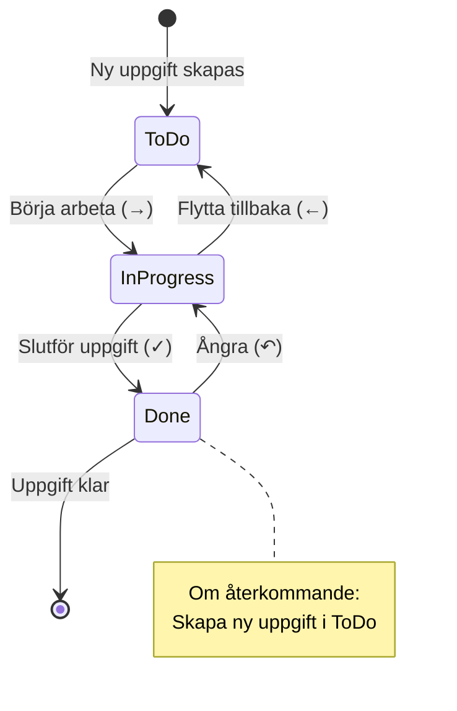

## Återkommande Uppgifter - Dataflöde

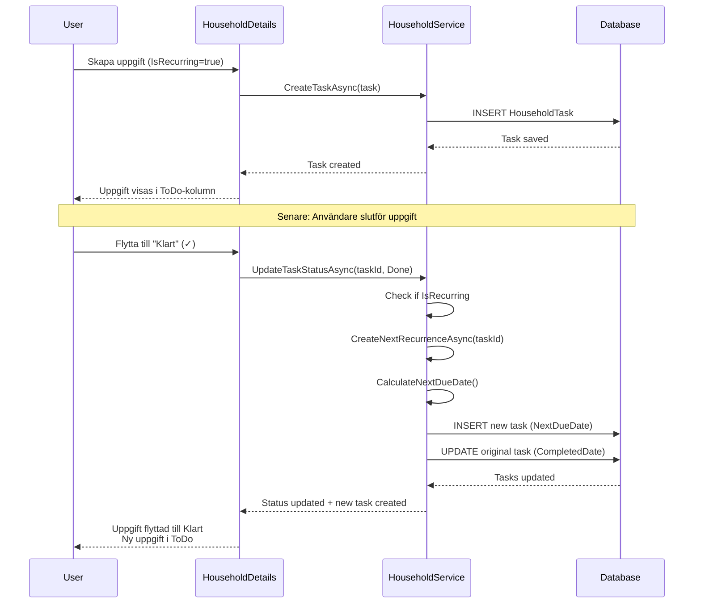

## Beräkning av Nästa Förfallodatum

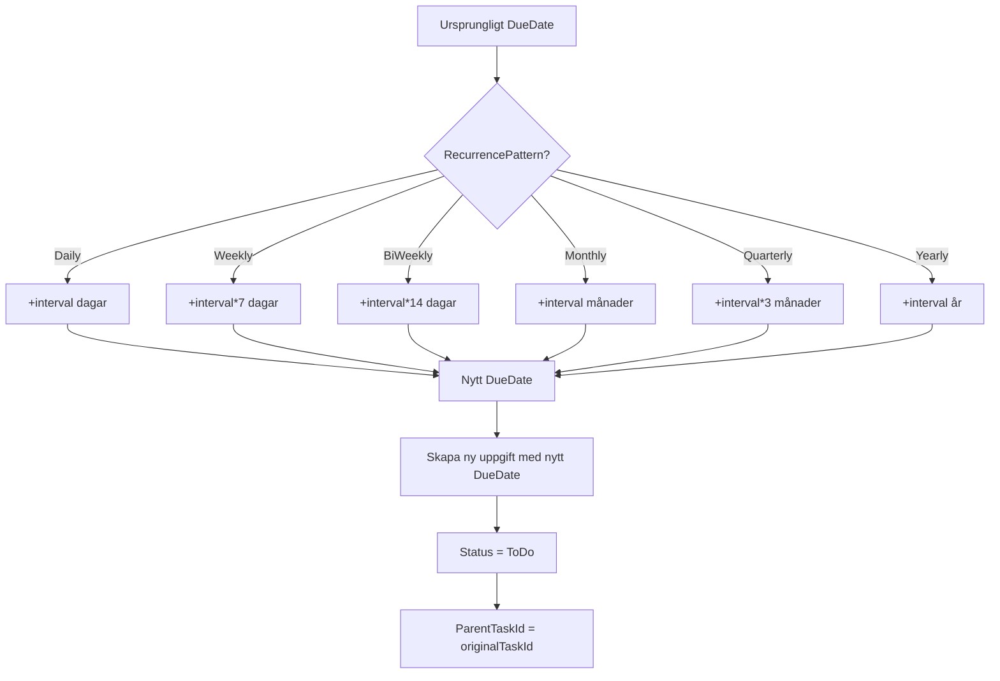

## Kanban Board Komponentstruktur

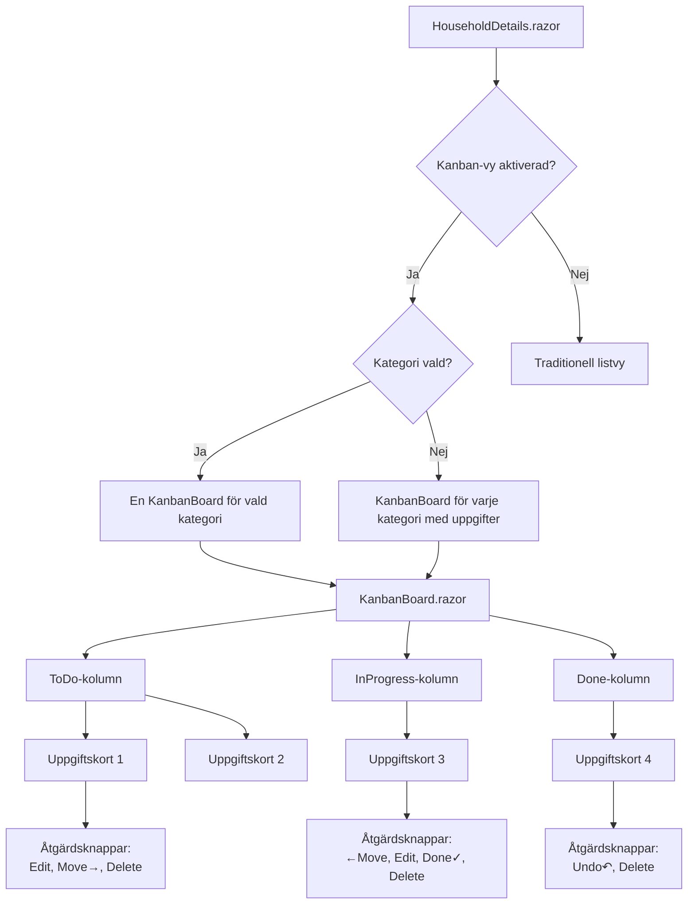

## Användarinteraktion - Kanban

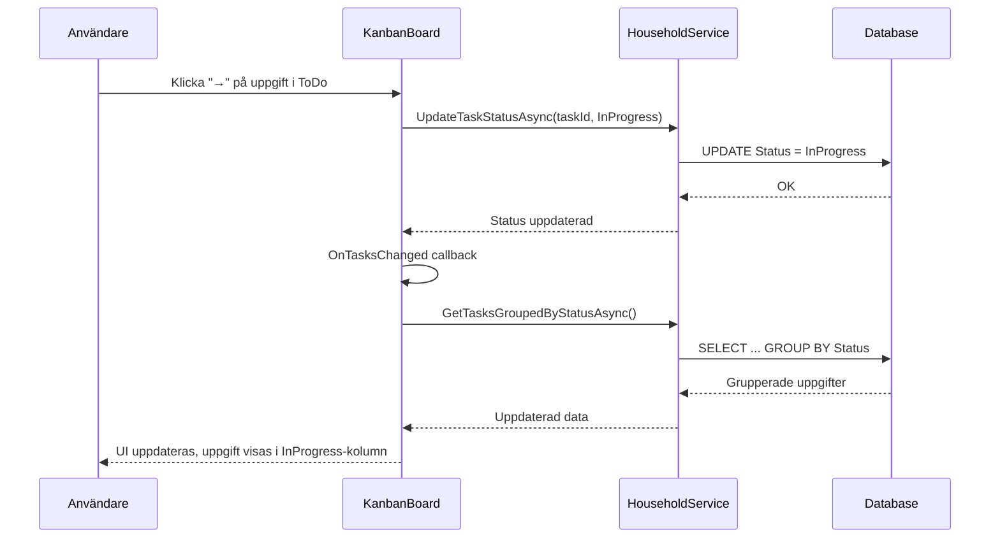

## Databas Schema (Nya fält)

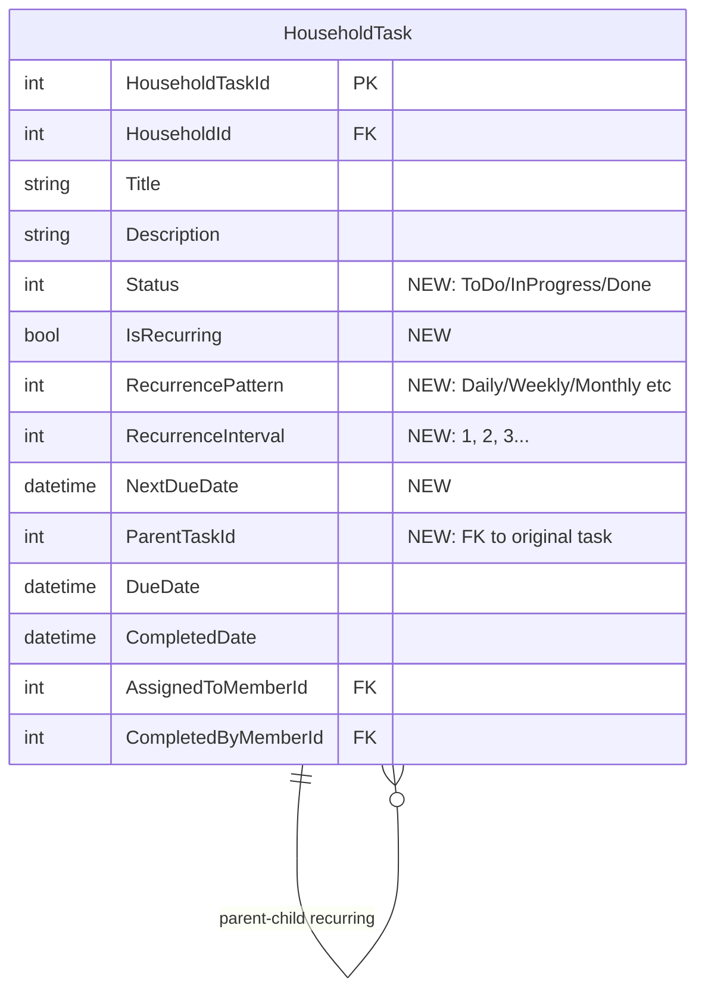

## State Management - Uppgiftsstatus

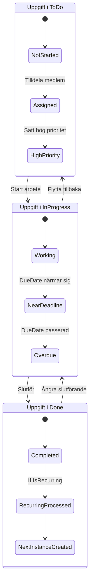

## Kategorifiltrering

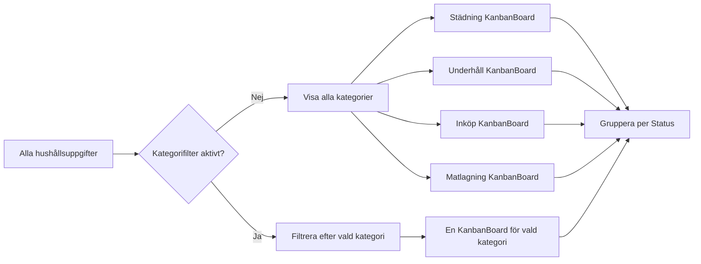

## Exempel: Veckovis Städning

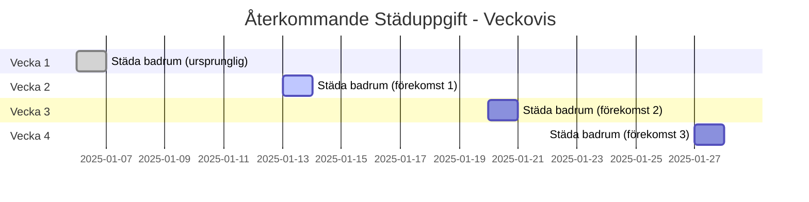

## Responsiv Layout

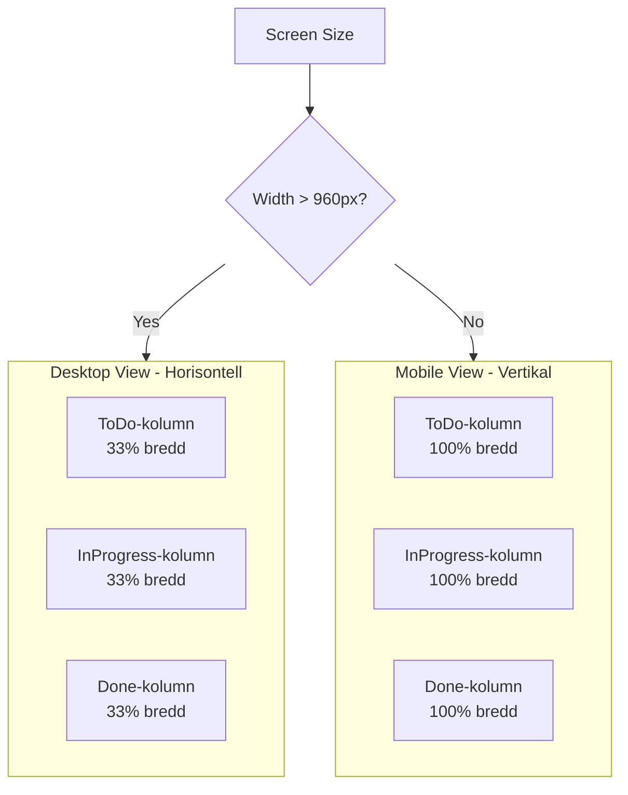

## Säkerhet och Dataisolering

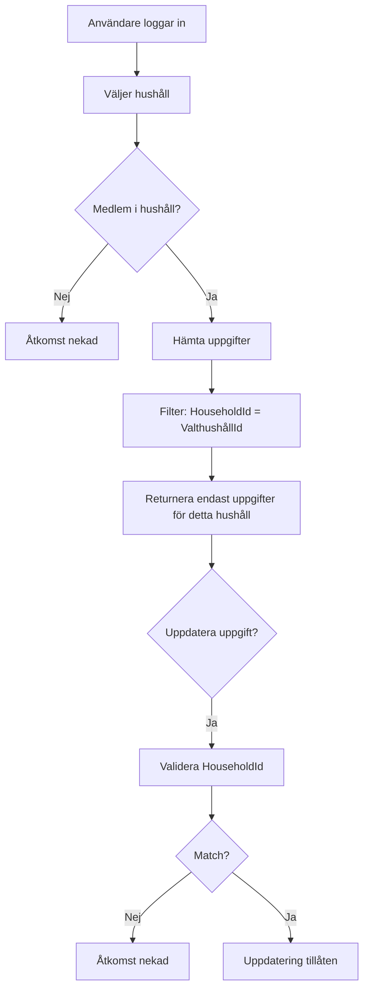
