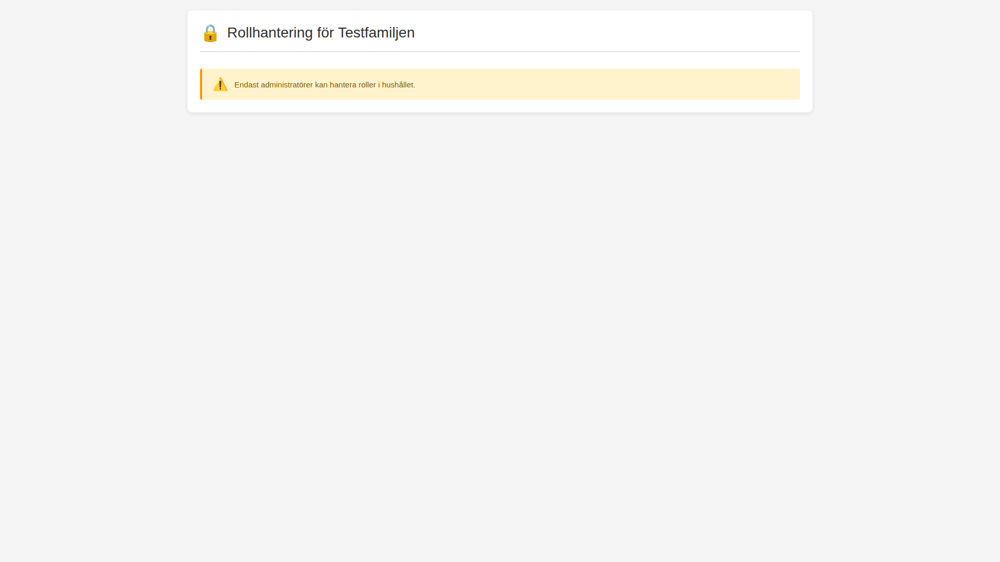

# Rollhantering (Role Management) - Screenshots

Denna mapp innehåller screenshots som visar funktionaliteten i RoleManagement-sidan (`src/Privatekonomi.Web/Components/Pages/RoleManagement.razor`).

## Översikt

RoleManagement-sidan är en del av RBAC-systemet (Role-Based Access Control) och tillåter administratörer att hantera roller och behörigheter för hushållsmedlemmar.

## Screenshots

### 1. Fullständig översikt av Rollhanteringssidan
**Fil:** `01-role-management-overview.png`

Denna screenshot visar den kompletta rollhanteringssidan med följande funktioner:

#### Medlemmar och roller (Tabell)
- Visar alla hushållsmedlemmar med deras aktuella roller
- Roller visas med färgkodade chips:
  - **Röd (Admin):** Administratör - Full kontroll över hushållet
  - **Orange (Full Access):** Full åtkomst - Hantera ekonomi, ej medlemmar
  - **Blå (Editor):** Redigerare - Skapa/ändra egna data
  - **Grå (View Only):** Endast visning - Läsrättigheter
  - **Grön (Child):** Barn - Barnkonto med begränsningar
- Delegerade roller visas med extra chip som anger slutdatum
- Knappar för att ändra roll och överföra admin-rollen

#### Aktiva delegeringar
- Visar alla pågående tillfälliga rolltilldelningar
- Visar vem som har delegeringen och när den upphör
- Återkalla-knapp för att omedelbart ta bort delegeringen

#### Rollbeskrivningar
- Komplett lista över alla tillgängliga roller
- Ikoner och beskrivningar för varje roll
- Hjälper användare att förstå olika behörighetsnivåer

### 2. Åtkomst nekad för icke-administratörer
**Fil:** `02-non-admin-access-denied.png`

Visar säkerhetskontrollen som förhindrar icke-administratörer från att komma åt rollhanteringssidan. Endast varning visas med meddelandet "Endast administratörer kan hantera roller i hushållet."

## Funktioner som visas

### Rolltyper (6 st)
1. **Admin (Administratör)** - Full kontroll, kan hantera allt
2. **Full Access (Full åtkomst)** - Hantera transaktioner, budget, viss statistik
3. **Editor (Redigerare)** - Skapa/ändra egna data, begränsningar på belopp
4. **View Only (Endast visning)** - Endast se data/statistik
5. **Limited (Begränsad)** - Hantera endast egna transaktioner
6. **Child (Barn)** - Enbart sitt eget konto, barnrestriktioner

### Delegation
- Visar delegerade roller med tidsbegränsning
- Möjlighet att återkalla delegationer
- Tydlig indikation när delegation upphör

### Säkerhet
- Endast administratörer har åtkomst till sidan
- Tydlig varning för icke-auktoriserade användare
- Admin-roll kan överföras säkert till annan medlem

## Teknisk implementation

Sidan använder:
- **MudBlazor** komponenter för UI (MudTable, MudChip, MudButton, etc.)
- **RbacService** för rollhantering och behörighetskontroll
- **HouseholdService** för att hämta hushållsdata
- **Färgkodning** för att tydligt visa olika rollnivåer
- **Audit logging** för alla rolländringar (ej visat i screenshots)

## Relaterade filer

- **Komponenten:** `src/Privatekonomi.Web/Components/Pages/RoleManagement.razor`
- **Service:** `src/Privatekonomi.Core/Services/RbacService.cs`
- **Modeller:** 
  - `src/Privatekonomi.Core/Models/HouseholdRole.cs`
  - `src/Privatekonomi.Core/Models/RolePermission.cs`
- **Specifikation:** `docs/RBAC_SPECIFICATION.md`

## Framtida förbättringar

Följande funktioner är planerade men ännu inte implementerade:
- Dialogruta för att tilldela/ändra roller
- Dialogruta för att skapa nya delegeringar
- Systemadministratörsdashboard
- Audit log-visning
- Real-time notifikationer vid rolländringar
